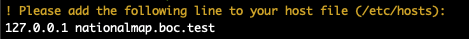

# Local Docker environment for {TEMPLATE_PROJECT_NAME}

A Docker-based local environment and toolbox for {TEMPLATE_PROJECT_NAME}.

## Prerequisites

[Docker Desktop](https://www.docker.com/products/docker-desktop) and [Git](https://git-scm.com/) should be installed on the host machine.

Cloning permission over SSH is required for the following repositories:

* The current repository;
* .

Github personal token setup and cached on your command-line git:

* [Creating a personal access token](https://docs.github.com/en/github/authenticating-to-github/keeping-your-account-and-data-secure/creating-a-personal-access-token)
* [Caching your Github credentials](https://docs.github.com/en/get-started/getting-started-with-git/caching-your-github-credentials-in-git)

The setup uses localhost's ports 80, 443, so make sure these are free.

It is also highly advised to have a terminal running [Bash](https://www.gnu.org/software/bash/) locally.

### OS Exceptions

* **Windows**: If you are running Microsoft's OS, please [head over here for special instructions and help](https://github.com/appwapp/cocoapp.dev.environment/blob/master/WINDOWS.md), and keep referring to it in case of trouble with the rest of the setup.
* **macOS (M1 chipset)**: If your mac has an M1 chipset, please replace the `docker-compose.yml` file with the `docker-compose-macos-m1.yml` file. You don't need to do this on an Intel chipset.

## Setup

Clone the current repository as a `{TEMPLATE_REPOSITORY}` directory:

```
$ git clone git@github.com:appwapp/{TEMPLATE_REPOSITORY}.git {TEMPLATE_REPOSITORY} && cd {TEMPLATE_REPOSITORY}
```

Run Bash on your system (e.g.: Git Bash), append the following function to your Bash config (`.bash_profile`, `.bashrc`, `.zshrc`...):

```bash
{TEMPLATE_COMMAND} () { cd <PATH>/{TEMPLATE_REPOSITORY} && bash .bashly/{TEMPLATE_COMMAND} $*; cd - }
```

Where `<PATH>` is the absolute path leading to the local `{TEMPLATE_REPOSITORY}` folder (where the current repository was cloned).

Open a new terminal window or `source` your Bash config file for the changes to take effect.

List the available commands by running:

```bash
$ {TEMPLATE_COMMAND}
```

Now run the following command:

```bash
$ {TEMPLATE_COMMAND} init
```

This will clone the required repositories, download and build the images listed in `docker-compose.yml`, create and start the corresponding containers, and do a bunch of other useful things (this might take a while).

**Note**: While running the initialization process, some manual operations might be needed. They will usually be flagged with a `!` and be showed as yellow text, please make sure to read carefully.



## Global usage

While `{TEMPLATE_COMMAND} init` will also start the containers, once everything is installed the regular way of doing so is by running the following command:

```bash
$ {TEMPLATE_COMMAND} start
```

And to stop the containers:

```bash
$ {TEMPLATE_COMMAND} stop
```

To restart the already-running containers:

```bash
$ {TEMPLATE_COMMAND} restart
```

To scrap everything and start over with a clean environment:

```bash
$ {TEMPLATE_COMMAND} init
```

Finally, run the following command to ensure your local environment is up to date:

```bash
$ {TEMPLATE_COMMAND} update
```

A lot of other useful commands are available, list them all by simply running:

```bash
$ {TEMPLATE_COMMAND}
```

## SSL

The SSL part of this local Docker environment is handled by a wildcard self-signed certificate for `*.{TEMPLATE_DOMAIN}`.

The first time you run `{TEMPLATE_COMMAND} init`, Nginx's container is used to generate the certificate in `.docker/nginx/certs`, which is then automatically installed on your machine (Mac or Debian-based) as well as in the relevant containers. It is used by Nginx to serve the various components.

This setup effectively allows communication over SSL everywhere, mimicking a production environment.

On Firefox, you might need to set the `security.enterprise_roots.enabled` property to `true` from the [about:config](about:config) page.

> **Note for Windows users:** if you are running Microsoft's OS, you will need to install the certificate manually on your machine. Please refer to the [special instructions](blob/master/WINDOWS.md).

If you need to generate and install a new certificate, run the following commands:

```bash
$ {TEMPLATE_COMMAND} ssl generate
$ {TEMPLATE_COMMAND} ssl install
```

## Ditch

To completely rid the system of the project, run the following command:

```bash
$ {TEMPLATE_COMMAND} destroy
```

It will remove the containers, volumes and images associated to the Docker Compose setup, only leaving the content of the various repositories.

## Advanced

The `{TEMPLATE_COMMAND}` commands are essentially sugarcoating Docker and Docker Compose commands to make the developer's life easier whilst interacting with the ecosystem in a day-to-day way.

Have a look at the [`.bashly/src`](https://github.com/appwapp/{TEMPLATE_REPOSITORY}/blob/master/.bashly/src) files for reference.

Overall, any regular Docker command can be run from the project's root. For example:

```bash
$ docker compose down -v
$ docker compose up -d
```

Basically, anything that is not covered by a `{TEMPLATE_COMMAND}` shortcut can be run manually.

For instance, you might want to open a shell on a running container:

```bash
$ docker-compose exec <SERVICE_NAME> sh
```

Where `<SERVICE_NAME>` is the name of one of the services listed in `docker-compose.yml` (e.g. `client`, `nginx`, etc.).


The [Docker](https://docs.docker.com/engine/reference/run/) and [Docker Compose](https://docs.docker.com/compose/reference/) command line references are good starting points to explore further possibilities.
