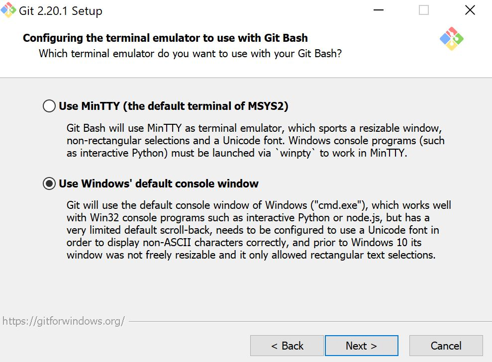

> ⬅️ [Go back to the general instructions](https://github.com/fderbali/itbookmarks.dev.environment)

# Local Docker environment for Bank of Canada - instructions for Windows

## Virtualization, Hyper-V and VirtualBox

Docker needs hardware virtualization capabilities to run properly. On Windows, such capabilities are provided for by Hyper-V, which is only available on the 64-bit versions of Windows 10 Pro, Entreprise and Education.

**If you don't use any of those, you will not be able to run Docker for Windows.**

If you do, Hyper-V is probably already enabled. If Docker thinks otherwise, head [over here](https://docs.microsoft.com/en-us/virtualization/hyper-v-on-windows/quick-start/enable-hyper-v) for instructions about how to activate it.

Once Hyper-V is running, you might notice that VirtualBox doesn't work anymore: it is essentially because Hyper-V transforms Windows into a virtual machine on which VirtualBox cannot run.

Read more about [virtualization on Windows](https://docs.microsoft.com/en-us/virtualization/#pivot=main&panel=windows), and about the [conflicts between Hyper-V and VirtualBox](https://superuser.com/a/1208857).

## Terminal

To be able to use the Docker environment for Itbookmarks properly, you will need a terminal running both Git and Bash. We recommend [Git Bash](https://gitforwindows.org/), which comes with Git for Windows.

Also, based on this [article](https://willi.am/blog/2016/08/08/docker-for-windows-interactive-sessions-in-mintty-git-bash/), you'll be asked to choose an emulator : select the `Windows' default console` instead of the `MinTTY` one.



### SSH

Once the program is installed, open it and run the following command:

```
$ ls -l ~/.ssh
```

If you don't see a couple of files named `id_rsa` and `id_rsa.pub` or if the folder doesn't exist, run the following command and hit _return_ at every prompt:

```
$ ssh-keygen -o
```

This will basically generate a public/private rsa key pair so Git Bash can interact with GitHub via SSH.

Run the following command to display your public key and copy the result:

```
$ cat ~/.ssh/id_rsa.pub
```

Paste it as a new SSH key in your [GitHub settings](https://github.com/settings/keys).

### Bash

Finally, run `vi ~/.bash_profile` and paste the following:

```
function boc 
    cd <PATH>/itbookmarks.dev.environment && bash .bashly/itbookmarks $*
        cd -

```

Where `<PATH>` is the absolute path leading to the local `itbookmarks.dev.environment` folder.

Run `source ~/.bash_profile` followed by `boc`: the application menu should display.

Your Git Bash is all set!

## Local folder and disk sharing

To avoid permission issues, it is recommended NOT to clone the project in your `~/Documents/` folder.

You will need to share your drive with Docker, which you can do in [Docker's settings](https://docs.docker.com/docker-for-windows/#shared-drives).

Note that it will prompt you for your account's password, and won't allow to submit an empty string. Meaning if you don't have a password for your account, you will probably have to set one first.

## Self-signed SSL certificate

The initialisation of the Docker environment generates a self-signed certificate located in `.docker/nginx/certs`, which unfortunately cannot be installed automatically on a Windows machine.

The following explanation is based on [this tutorial](https://www.thewindowsclub.com/manage-trusted-root-certificates-windows) (link provided for reference).

Launch the `Run` application as admin and execute the `mmc` command.

### Adding Certificates Snap-in

This Snap-in allows us to add the certificate into a certificate store.

Go to `File > Add/Remove Snap-in` and add `Certificates`.  
In the window, select `Computer account` and click on `Next`.  
Select `Local computer` and click on `Finish`.  
Then click on `OK`.

Now, back in the main MMC window, from the console tree on the left-hand side,
right-click on `Certificates > Trusted Root Certification Authorities` and go to `All tasks > import`.

In the Certificate Import Wizard, click `Next`.  
`Browse` and select the `Certificate authority file (.docker/nginx/certs/itbookmarks.test.crt)` and click `Next`.  
Select `Put all certificates in the following store`, click `browse` and select `Trusted root Certification Authorities` if not already selected, then click `Next`.  
Then click `Finish`.

## Port 80

The local setup needs port 80 to be available, but the port might already be in use (which will most likely prevent the Nginx container from starting properly).

A quick way to free up the port is to run the following command as admin **in Windows' Command Prompt** (not Git Bash):

```
$ net stop http /y
```

If you still have issues, have a look at [this article](http://www.devside.net/wamp-server/opening-up-port-80-for-apache-to-use-on-windows).

## Other resources and fixes

* [Get started with Docker for Windows](https://docs.docker.com/docker-for-windows/);
* [Logs and troubleshooting](https://docs.docker.com/docker-for-windows/troubleshoot/);
* [Extremely slow on Windows 10](https://github.com/docker/for-win/issues/1936);
* [Unable to bind ports](https://github.com/docker/for-win/issues/3171).

> ⬅️ [Go back to the general instructions](https://github.com/appwapp/itbookmarks.dev.environment)
